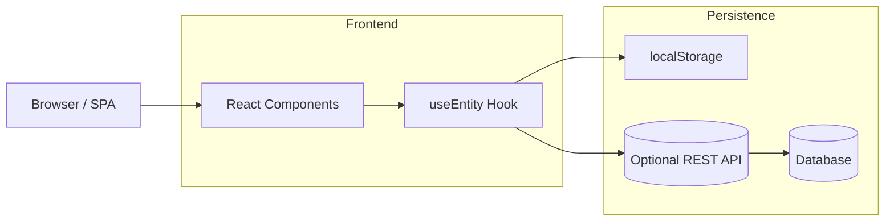

APGB_SYSTEM — Documentação Técnica

1. Visão Geral

APGB_SYSTEM é uma aplicação web de gestão portuária. É construída como uma SPA React (Vite) e mantém dados em localStorage via o hook `useEntity`. A UI usa componentes reutilizáveis em `frontend/src/components` e páginas em `frontend/src/pages`.

2. Estrutura do Repositório (resumo)

- `frontend/index.html` — entrada do frontend
- `frontend/package.json` — scripts/dependências do frontend
- `backend/server.js` — servidor API / backend leve
- `frontend/vite.config.js` — configuração Vite
- `frontend/public/` — ativos estáticos
- `frontend/src/` — código fonte do frontend
  - `components/` — componentes compartilhados
  - `pages/` — páginas da aplicação
  - `hooks/` — hooks (inclui `useEntity`)
  - `data/` — seeds e dados de exemplo
  - `lib/` — utilitários

3. Dados e Persistência

- `useEntity` (`frontend/src/hooks/useEntity.js`): hook CRUD que persiste por `localStorage` sob chaves `portocais_<entity>`; também suporta API caso `VITE_API_BASE_URL` seja configurado.
- Seeds estão em `frontend/src/data/seedData.js` e são carregados automaticamente se não houver dados em `localStorage`.

4. Como rodar (Frontend)

- Instalar dependências:

```bash
cd frontend
npm install
cd ../backend
npm install
```

- Rodar em desenvolvimento:

```bash
npm run dev
```

- Build para produção:

```bash
npm run build
```

- Iniciar backend:

```bash
npm run serve-api
```

5. Separação Frontend / Backend (implementado)

O projeto foi reorganizado em dois diretórios no root:

- `frontend/` contém o React + Vite app
- `backend/` contém o servidor Express leve

Mudanças aplicadas:
- Frontend movido para `frontend/` com `index.html`, `package.json`, `vite.config.js`, `public/` e `src/`.
- Backend movido para `backend/` com `server.js`, `scaffold.cjs` e `backend/package.json`.
- O `backend/server.js` importa `frontend/src/data/seedData.js` para inicializar o banco de dados JSON.
- O `package.json` raiz agora usa scripts wrapper para executar os comandos de cada subprojeto.

Observações:
- Instale dependências separadamente em `frontend/` e `backend/`.
- O root `package.json` mantém apenas scripts; as dependências estão nos subprojetos.

6. APIs e Extensões

- `useEntity` pode ser apontado para um backend real configurando `VITE_API_BASE_URL`.
- Para integrar um backend Express/NodeJS, crie endpoints REST em `backend/` e ajuste `useEntity` para usar a API.

7. Componentes Principais (resumo)

- `frontend/src/components/shared/Modal.jsx` — componente modal reutilizável usado em Configurações e Site.
- `frontend/src/hooks/useEntity.js` — CRUD + localStorage + sync event `entity-updated`.
- `frontend/src/pages/site/SiteInstitucional.jsx` — homepage pública com seções: Serviços, Vídeos, Notícias, FAQs, Contato.
- `frontend/src/pages/Dashboard.jsx` — painel interno com gráficos (usa Recharts).

8. Últimas alterações (resumo operacionais)

- Vídeos: filtragem por `ativo` e ordenação por `id` decrescente; suporte a YouTube/Vimeo via embed; modal de detalhe implementado.
- `handleSalvarVideo` em `src/pages/Configuracoes.jsx` foi tornado assíncrono e valida URL/arquivo.
- Tooltip no gráfico de Movimentação de Navios foi adicionado para mostrar detalhes dos navios por dia.

9. Próximos passos sugeridos

- A reorganização do projeto já foi concluída: o código agora está em `frontend/` e `backend/`.
- Adicionar testes automatizados e pipeline CI.
- Implementar backend real (Express/REST ou Fastify) e converter `useEntity` para consumir API.

---

A reorganização já foi aplicada. Agora você pode validar a nova estrutura, adicionar CI ou continuar estendendo o backend.

10. Arquitetura do Sistema

10.1 Visão Geral

O sistema é uma aplicação web monolítica com camadas lógico-visuais (frontend) e de dados. Atualmente a persistência padrão é `localStorage` com opção para apontar `useEntity` a uma API REST (configurar `VITE_API_BASE_URL`). A arquitetura proposta é modular e permite separar `frontend` e `backend` em pastas distintas ou serviços separados.

10.2 Componentes Principais

- Frontend (SPA React + Vite)
  - `src/` — componentes, páginas, hooks, assets, i18n
  - libs principais: `react`, `react-router-dom`, `recharts`, `react-i18next`, `lucide-react`
- Persistência / Abstração de dados
  - `src/hooks/useEntity.js` — interface CRUD; adapter localStorage ou API HTTP
- Backend (opcional)
  - Endpoint REST sugerido: `/api/:entity` (GET, POST, PUT, DELETE)
  - Autenticação via JWT / sessão (se necessário)
- Admin CMS (Configurações)
  - Upload de vídeos, gestão de conteúdo, utilizadores — usa `useEntity` atualmente

10.3 Fluxo de Dados (Resumo)

- Leitura inicial: Frontend carrega seeds de `frontend/src/data/seedData.js` em `localStorage` quando vazio.
- Operações de CRUD: `useEntity` atualiza `localStorage` e dispara evento `entity-updated` para sincronizar componentes.
- Quando `VITE_API_BASE_URL` é definido, `useEntity` passa a realizar chamadas HTTP para o backend.

10.4 Diagrama (fluxo simplificado)



10.5 Recomendações de Separação (frontend/backend)

- Estruturar repositório em dois diretórios na raiz: `frontend/` e `backend/`.
- `frontend/` deve conter: `package.json`, `vite.config.js`, `src/`, `public/`, `index.html`.
- `backend/` pode ser um projeto Node.js (Express/Fastify) com `package.json`, `src/` e `routes/`.
- Atualizar variáveis e scripts (`frontend/package.json` scripts `dev`, `build`, `start`) e CI para apontar para as novas pastas.

10.6 Segurança e Operação

- Não armazenar credenciais em `localStorage` em produção. Mudar `useEntity` para usar API com autenticação.
- Validar uploads de ficheiros (tamanho, tipo) no backend; usar armazenamento object storage (S3) para vídeos grandes.
- Usar HTTPS e políticas CORS restritivas entre frontend e backend.

10.7 Escalabilidade e Extensibilidade

- Separar serviços por responsabilidades: API de conteúdo (vídeos/notícias), API de RH (funcionários/reformas), API operacional (atracagens/pesagens/manifests).
- Adotar cache (Redis) e base de dados relacional (Postgres) para dados transacionais.

Se quiser, aplico a reorganização física do repositório agora e atualizo scripts e paths automaticamente. Caso prefira validar manualmente, gero um passo-a-passo executável.